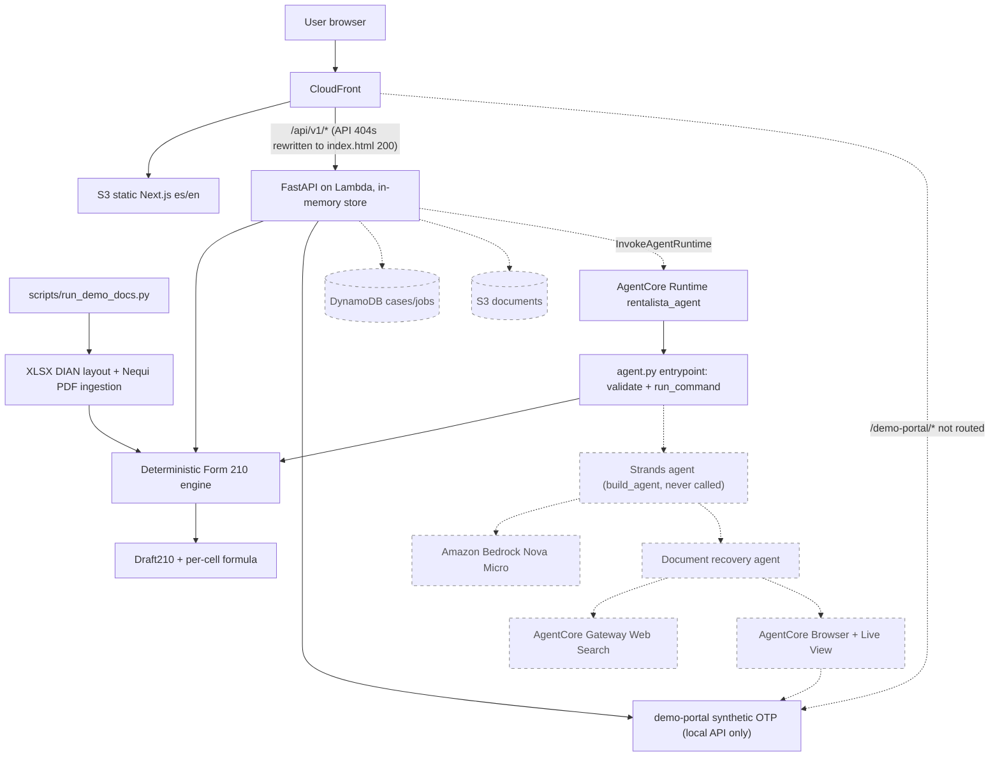

# RentaLista architecture

Solid arrows and nodes: implemented and exercised by code in this repo.
Dashed arrows and nodes: planned, not wired yet (state at the 11 Sep 2026 code review, see DOC.md).

